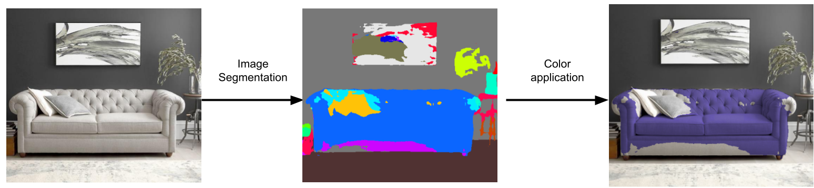

# Quick-Color
Web Application:- Given an image, the algorithm will automatically segment and a user can apply color to the segments.

### Pipeline

For live demo, please visit [Quick-Color](https://submagr.github.io/Quick-Color).

### TODO:
* [] User should be able to select various segment
* [] User should be able to download the final image
* [] Blend colors
* [] Replace category mask prediction using Deeplab-V3 with more general object selection algorithm

### Contributing
For contributing, please contact sa3762@columbia.edu

